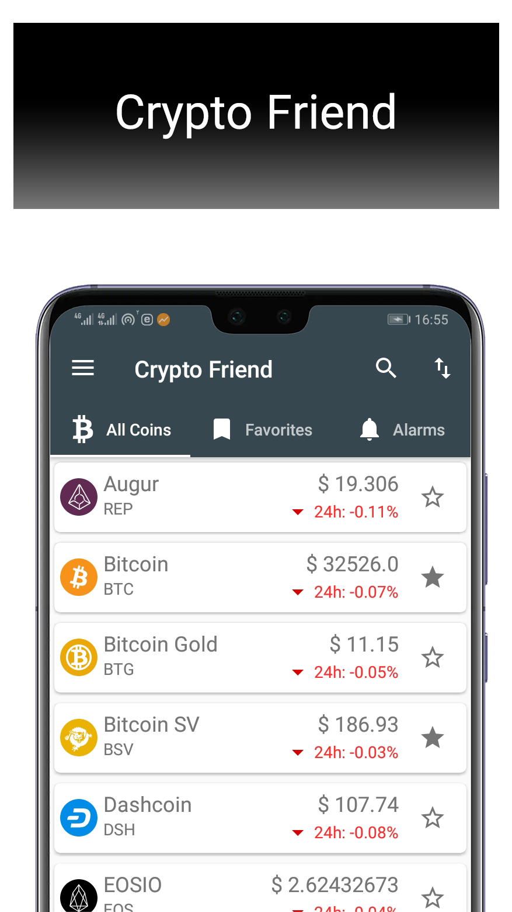
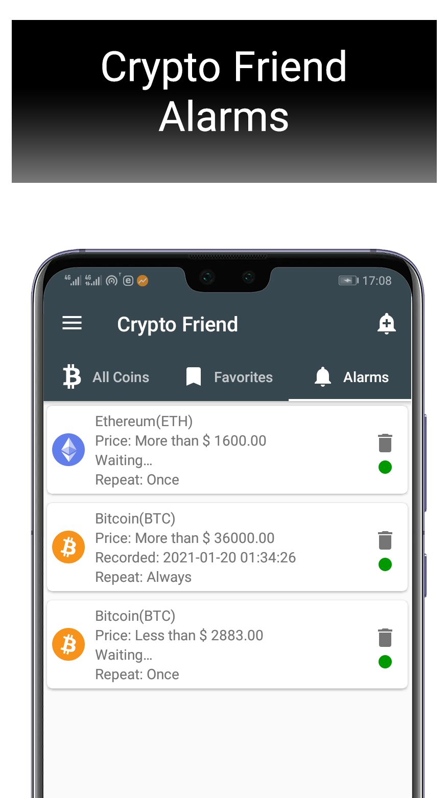
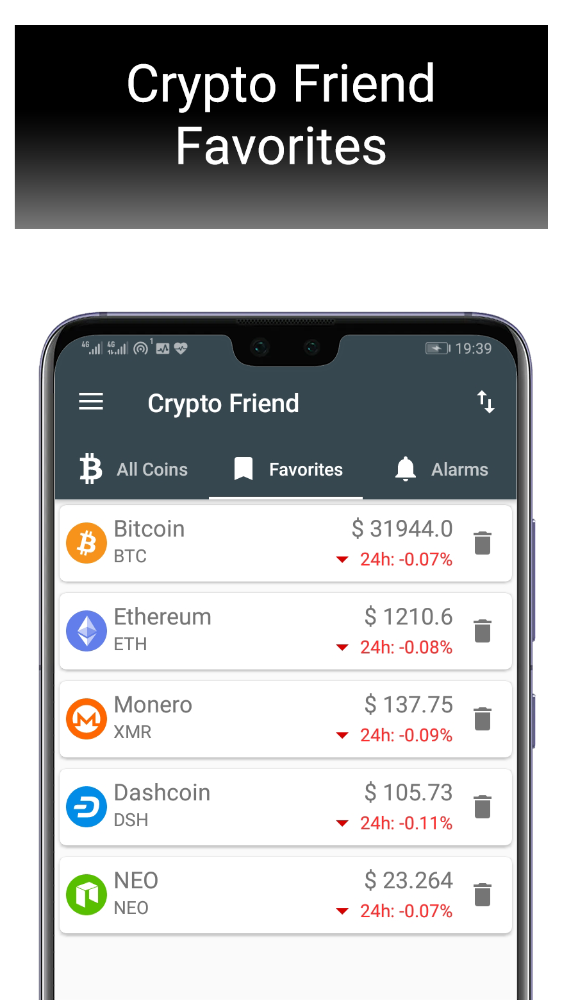

# Crypto Friend
Get the latest prices and news about Popular Crypto Currencies

## Useful information:
* IDE: Android Studio 4.1+
* Programming language: Java

## Sources
* [CryptoCompare min-api](https://min-api.cryptocompare.com/) (news source): In this app, this API  is used to get news related to cryptocurrencies.
* [Bitfinex](https://docs.bitfinex.com/) (prices): This API has been used to get the price of cryptocurrencies.

## APK Link
* [Google Play](https://play.google.com/store/apps/details?id=com.ham3da.cryptofreind)

## Open Source projects
* We have used the following open source projects to develop this app: *.
[CryptoBuddy](https://github.com/Patchett/CryptoBuddy)

## Screenshots

 
 
 

